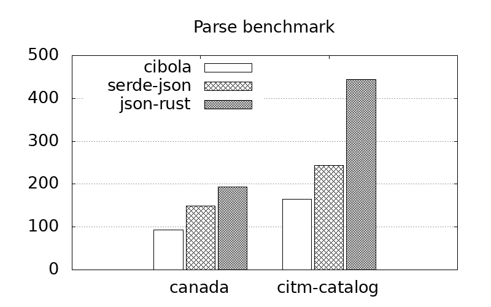

# Cibola

A json toy parser

### current speed, or a lack thereof



```
parsing/CIBOLA::canada  time:   [23.151 ms 23.212 ms 23.287 ms]
                        thrpt:  [92.187 MiB/s 92.485 MiB/s 92.728 MiB/s]

parsing/CIBOLA::citm_catalog
                        time:   [12.958 ms 13.003 ms 13.049 ms]
                        thrpt:  [164.51 MiB/s 165.10 MiB/s 165.67 MiB/s]

parsing/serde_json::canada
                        time:   [14.293 ms 14.347 ms 14.389 ms]
                        thrpt:  [149.20 MiB/s 149.63 MiB/s 150.20 MiB/s]

parsing/serde_json::citm_catalog
                        time:   [8.7627 ms 8.7905 ms 8.8167 ms]
                        thrpt:  [243.49 MiB/s 244.21 MiB/s 244.99 MiB/s]

parsing/json-rust::canada
                        time:   [11.071 ms 11.093 ms 11.124 ms]
                        thrpt:  [192.98 MiB/s 193.52 MiB/s 193.91 MiB/s]

parsing/json-rust::citm_catalog
                        time:   [4.8286 ms 4.8396 ms 4.8522 ms]
                        thrpt:  [442.43 MiB/s 443.59 MiB/s 444.60 MiB/s]
```

